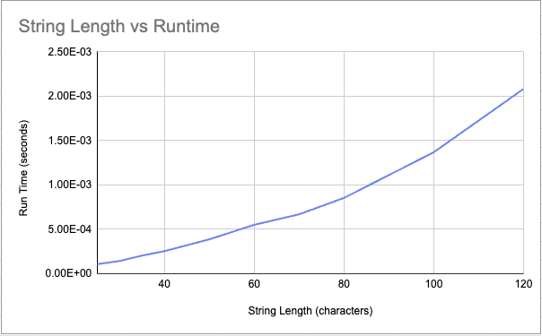
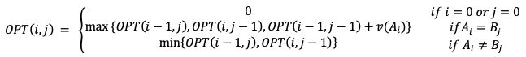

# COP4533 Programming Assignment 3: Highest Value Longest Common Sequence

## 1. Student Information
**Name:** Justin Lin  
**UFID:** 36425312  

## 2. How to Compile and Run

To run the program use the command from the following command from the project's root directory:
`python3 ./src/main.py ./tests/input/example.in`

"example.in" may be substituted with any of the provided test cases in the `./tests/input` directory
Some examples of commands that are valid could be:
- `python3 ./src/main.py ./tests/input/test1.in`
- `python3 ./src/main.py ./tests/input/test2.in`

## 3. Assumptions

The program assumes the following:

- All character values are **nonnegative integers**  
- The alphabet consists of **distinct characters**  
- Characters in strings `A` and `B` are always present in the given alphabet to value map
- Strings `A` and `B` contain only valid alphabet characters  
- Input format strictly follows the specification  
- Strings may be of different lengths  

## 4. Written Solutions

### Question 1:

Since all the test cases used were roughly identical in lengths of their respective A's and B's, this should show us a quadratic growth as the time complexity of the dynamic programming algorithm comes out to O(nm) 

### Question 2:
#### Base Cases:
OPT(0, j) = 0; OPT(i, 0) = 0

#### Recurrence Equation:

The recurrence is correct because it considers all the possible optimal subsequences by either skipping a character from one of the strings or matching the last chacters if they're equal. Each case would reduce the larger problem into a smaller subproblem to then take the maximum for the maximized solution.

### Question 3:

